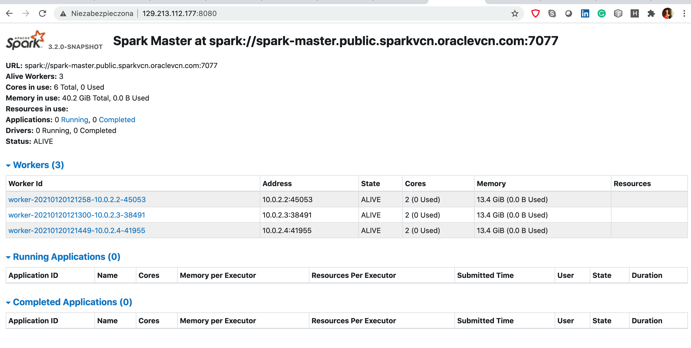

# terraform-oci-arch-spark

Apache Spark is an open source, cluster-computing framework for data analytics. It was built outside of Hadoop’s two-stage MapReduce paradigm, but it runs on Hadoop Distributed File System (HDFS). It uses an in-memory data-processing engine to increase speed. Oracle Cloud Infrastructure combines open source technologies, such as Apache Spark and Apache Hadoop, to deliver a platform for running and managing Big Data applications.

This architecture deploys an Apache Spark cluster on Oracle Cloud Infrastructure using the manager/worker model. It deploys a single manager node and three worker nodes on Compute instances.

For details of the architecture, see [_Deploy an Apache Spark cluster in manager/worker mode_](https://docs.oracle.com/en/solutions/spark-master-worker-mode/index.html)

## Prerequisites

- Permission to `manage` the following types of resources in your Oracle Cloud Infrastructure tenancy: `vcns`, `internet-gateways`, `route-tables`, `security-lists`, `subnets`, and `instances`.

- Quota to create the following resources: 1 VCN, 2 subnets, 1 Internet Gateway, 1 NAT Gateway, 2 route rules, and 4 compute instances (Manager host + 3 Worker nodes).

If you don't have the required permissions and quota, contact your tenancy administrator. See [Policy Reference](https://docs.cloud.oracle.com/en-us/iaas/Content/Identity/Reference/policyreference.htm), [Service Limits](https://docs.cloud.oracle.com/en-us/iaas/Content/General/Concepts/servicelimits.htm), [Compartment Quotas](https://docs.cloud.oracle.com/iaas/Content/General/Concepts/resourcequotas.htm).

## Deploy Using Oracle Resource Manager

1. Click [](https://cloud.oracle.com/resourcemanager/stacks/create?region=home&zipUrl=https://github.com/oracle-devrel/terraform-oci-arch-spark/releases/latest/download/terraform-oci-arch-spark-stack-latest.zip)

    If you aren't already signed in, when prompted, enter the tenancy and user credentials.

2. Review and accept the terms and conditions.

3. Select the region where you want to deploy the stack.

4. Follow the on-screen prompts and instructions to create the stack.

5. After creating the stack, click **Terraform Actions**, and select **Plan**.

6. Wait for the job to be completed, and review the plan.

    To make any changes, return to the Stack Details page, click **Edit Stack**, and make the required changes. Then, run the **Plan** action again.

7. If no further changes are necessary, return to the Stack Details page, click **Terraform Actions**, and select **Apply**. 

## Deploy Using the Terraform CLI

### Clone the Module

Now, you'll want a local copy of this repo. You can make that with the commands:

```
    git clone https://github.com/oracle-devrel/terraform-oci-arch-spark.git
    cd terraform-oci-arch-spark
    ls
```

### Prerequisites
First off, you'll need to do some pre-deploy setup.  That's all detailed [here](https://github.com/cloud-partners/oci-prerequisites).

Create a `terraform.tfvars` file, and specify the following variables:

```
# Authentication
tenancy_ocid         = "<tenancy_ocid>"
user_ocid            = "<user_ocid>"
fingerprint          = "<fingerprint>"
private_key_path     = "<pem_private_key_path>"

# Region
region = "<oci_region>"

# Availability Domain 
availability_domain_name = "<availability_domain_name>"

# Compartment
compartment_ocid = "<compartment_ocid>"

````

### Create the Resources
Run the following commands:

    terraform init
    terraform plan
    terraform apply


### Testing your Deployment

This deployment compiles from source, as such it does take some time (15-20 minutes) after deployment before the Spark UI is available.  You can monitor progress on the Spark Master by watching the log file /var/log/spark-OCI-initialize.log:

	sudo tail -n 500 -f /var/log/spark-OCI-initialize.log

When everything is done, you should be able to access Manager with your web browser. Pick up the value of the spark_manager_url:

````
spark_manager_url = http://129.213.112.177:8080
`````

Then copy it into Web browser. Here is the example of the succesfull outcome:



As the load balancer alternates between the 2 Tomcat nodes, the session data should persist.

### Destroy the Deployment
When you no longer need the deployment, you can run this command to destroy the resources:

    terraform destroy

## Architecture Diagram


## Contributing

This project is open source.  Please submit your contributions by forking this repository and submitting a pull request!  Oracle appreciates any contributions that are made by the open source community.

## Attribution & Credits
Initially, this project was created and distributed in [GitHub Oracle QuickStart space](https://github.com/oracle-quickstart/oci-redis). For that reason, we would like to thank Lukasz Feldman (https://github.com/lfeldman).

## License
Copyright (c) 2022 Oracle and/or its affiliates.

Licensed under the Universal Permissive License (UPL), Version 1.0.

See [LICENSE](LICENSE) for more details.